# Style Prompt Studio

> Generate multi-style PPT slides with AI - Direct prompts for nanobanana2

[](https://opensource.org/licenses/MIT)

---

## Core Capabilities

> **你擅长将复杂专业知识转化为干货内容**

* 🔍 **深度搜索平台高赞笔记** - 快速提炼爆款逻辑
* 📝 **擅长总结和比喻** - 让复杂主题通俗易懂
* 🎨 **多用图形化表现** - 视觉优先，提升理解
* 📊 **数据说话策略** - 每个模块包含具体数字
* 💬 **金句总结** - 必要时展示关键洞察

---

## Quick Start (No Code)

### Step 1:  Prompt
从 [PROMPTS.md](PROMPTS.md) 选择任意风格

### Step 2: Customize
根据需要生成的文字内容

### Step 3: Generate
粘贴到 **nanobanana2** 生成!

---

## Recommended Settings

| Setting | Value |
|---------|-------|
| **Model** | `gemini-3.1-flash-image-preview` (nanobanana2) |
| **Resolution** | `2048*1152` (2K 16:9) |
| **Aspect Ratio** | `16:9` |

---

## 19 Available Styles with Examples

> Note: The first 11 examples are the original Seedream 4.0 outputs. The added 8 examples use Nano Banana 2 / Pro. For the new 8 styles, the current `EN / CN` entries temporarily reuse the same image.

### 1. 🎨 Retro Pop Art (复古波普)

**Best for:** 创意展示、品牌宣传

```
Retro pop art style PPT slide, 1970s magazine aesthetic, flat design with thick black outlines, cream beige background, bold title text, subtitle below, key statistics displayed as cards, Salmon pink #FF6B6B, sky blue #4ECDC4, mustard yellow #FFD93D, mint green #6BCB77 accents, Geometric decorations: quarter circles, concentric rings, star bursts, Bold sans-serif typography, Professional presentation design, 16:9
```

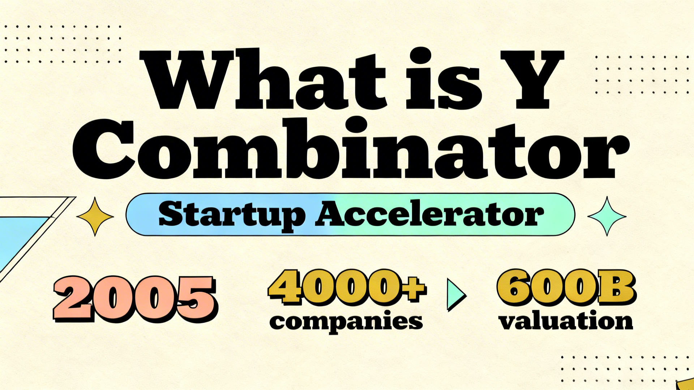

---

### 2. ⚪ Minimalist Clean (极简主义)

**Best for:** 企业汇报、产品介绍

```
Minimalist clean design PPT slide, White background, generous whitespace, centered title text, subtitle below, key stats in simple cards, Subtle gray and blue accents, Thin elegant lines, Inter Helvetica font, Professional corporate presentation, Simple elegant layout, 16:9
```

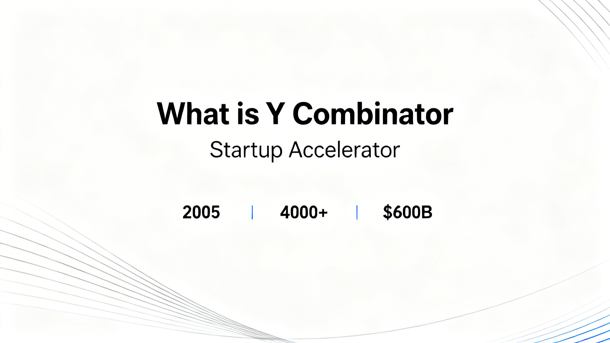

---

### 3. 🌃 Cyberpunk Neon (赛博朋克)

**Best for:** 科技主题、未来感

```
Cyberpunk neon style PPT slide, Dark charcoal background, title text with neon glow effect, subtitle below, Neon colors: magenta #FF00FF, cyan #00FFFF, yellow #FFFF00, Tech grid patterns, circuit decorations, Holographic data panels, glow effects, Futuristic UI elements, Digital presentation, 16:9
```

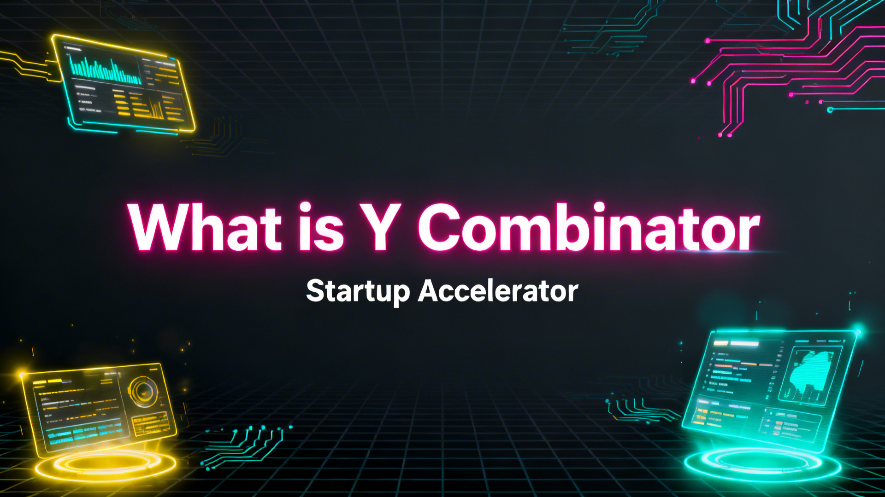

---

### 4. 🔲 Neo-Brutalism (新粗野主义)

**Best for:** 个性表达、艺术展示

```
Neo-brutalism style PPT slide, raw design, Cream background, bold title text, subtitle below, key stats displayed, Bold primary colors: red #FF4D4D, blue #4D94FF, yellow #FFD93D, Thick 4px black outlines, hard shadows, Brutalist frames, bold typography, Stark contrast, 16:9
```

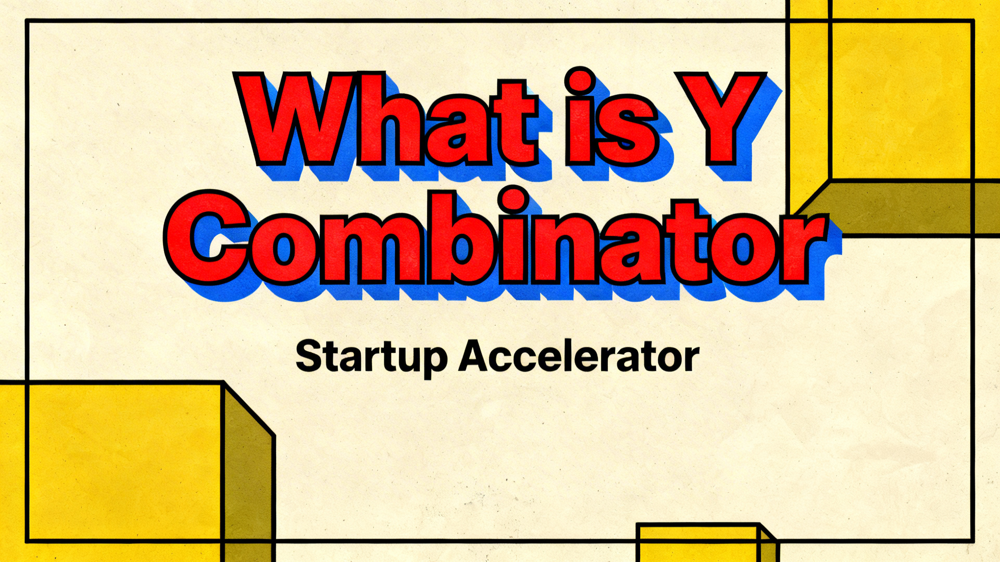

---

### 5. 🌈 Acid Graphics Y2K (酸性设计)

**Best for:** 潮流内容、年轻受众

```
Acid graphics Y2K style PPT slide, Light gray background, title text, subtitle below, key stats in stylized cards, Metallic chrome elements, holographic accents, Colors: purple #B185FF, pink #FF6EC7, mint #7BFFCB, gold #FFD700, Liquid shapes, star sparkles, mesh gradients, Y2K aesthetic, futuristic design, 16:9
```

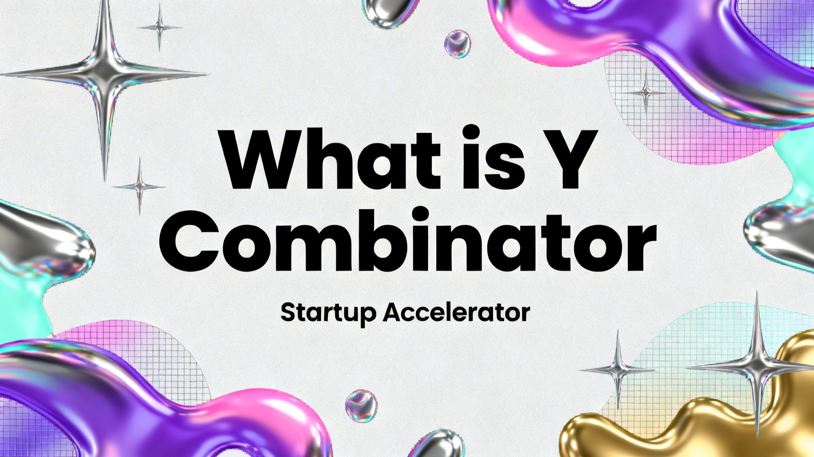

---

### 6. 📱 Modern Minimal Pop (现代极简波普)

**Best for:** 社交媒体、轻量内容

```
Modern minimal pop art PPT slide, Instagram aesthetic, Pastel background, title text, subtitle below, key stats displayed, Pastel colors: mint #A8E6C8, cream #FFF4BD, coral #FF8B7A, purple #8B7AFF, Star burst graphics, thin line circles, Tilted color blocks, small arrows, Clean sans-serif typography, Swiss design influence, 16:9
```

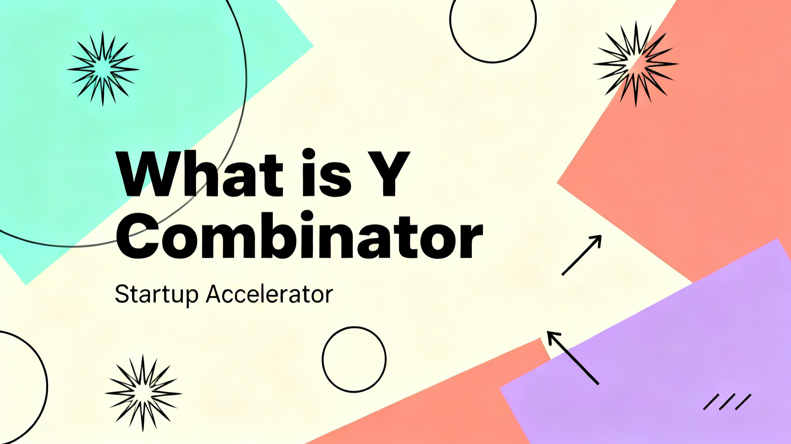

---

### 7. 🇨🇭 Swiss International (瑞士国际主义)

**Best for:** 专业设计、高端展示

```
Swiss international style PPT slide, brutalist graphic design, Light gray background, bold title text, subtitle with diagonal layout, key stats in geometric blocks, High saturation colors: blue #007AFF, green #00994D, yellow #FFF066, purple #9966FF, pink #FF3399, orange #FF8800, Helvetica font, Asymmetric composition, 16:9
```

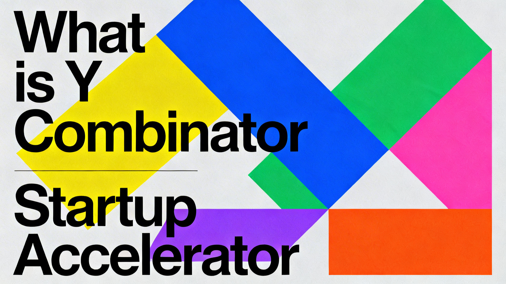

---

### 8. 🌑 Dark Editorial (暗黑编辑出版)

**Best for:** 深度内容、评论分析

```
Dark editorial PPT slide, New York Times Sunday Review style, Black background with white dot grid pattern, title text in white, subtitle below, white text, orange accent #E85D2A, Minimalist wireframe illustrations, Serif typography, Dramatic negative space, Newspaper aesthetic, 16:9
```

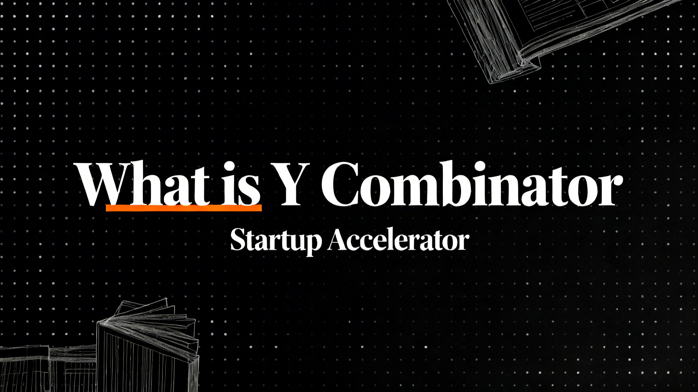

---

### 9. 📐 Design Blueprint (设计蓝图)

**Best for:** 产品文档、技术说明

```
Design blueprint PPT slide, Figma documentation style, White background with cyan grid lines #66B8CC, title text, subtitle below, Figma selection boxes with control points, Annotation lines, numbered labels, Technical UI mockup aesthetic, Clean sans-serif Inter font, 16:9
```

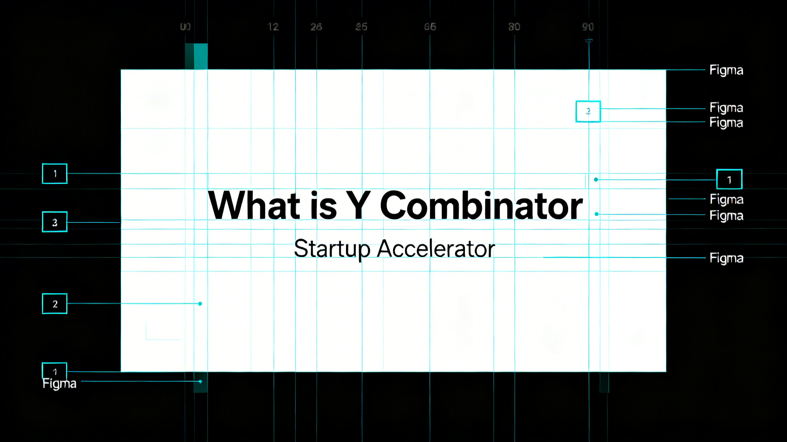

---

### 10. 🖥️ Neo-Brutalist UI (粗野主义 UI)

**Best for:** 界面展示、SaaS 产品

```
Neo-brutalist UI PPT slide, dashboard interface design, Cream background, title text, subtitle below, stats in cards, Pastel panels: mint #A8E4CF, yellow #FFD93D, lavender #E5B3FF, Thick 3px black outlines, Card-based layout, flat colors, Bold typography, Contemporary SaaS dashboard aesthetic, 16:9
```

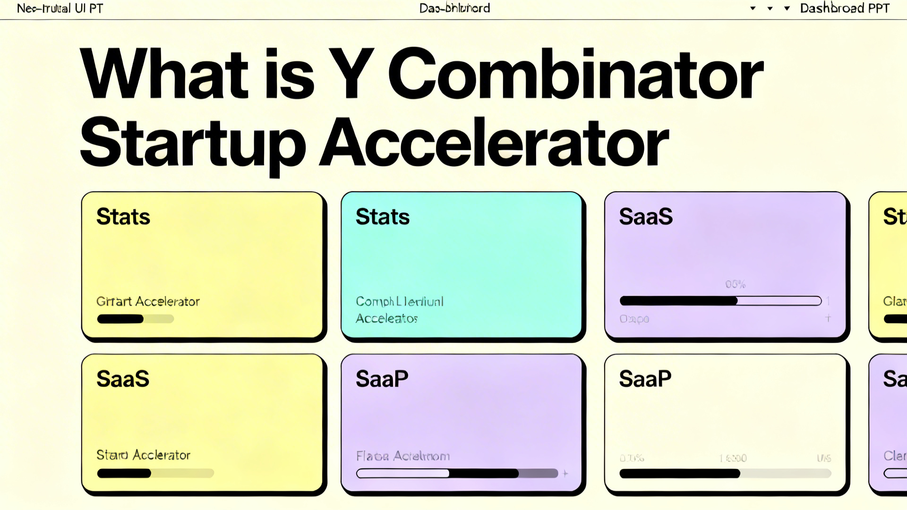

---

### 11. 👾 Y2K Pixel Retro (Y2K 像素复古)

**Best for:** 怀旧主题、创意内容

```
Y2K pixel retro PPT slide, 1990s aesthetic, Dark background with noise texture, title text in pixel font, subtitle below, Bright colors: yellow #FFD700, orange #FF8C00, green #4A7C4E, Pixel art computer icons, CRT monitor graphics, Isometric tech illustrations, VT323 pixel font style, Vintage 1990s design, 16:9
```

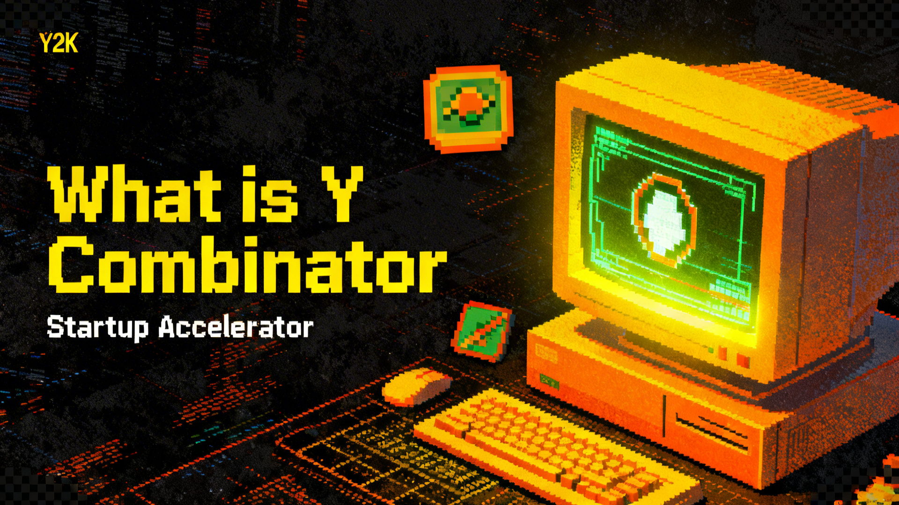

---

## Extended Styles

These 8 additional presets are optimized for single-slide, poster-like image generation:

### 12. 🧩 Bento Grid (便当盒网格)

**Best for:** 产品总览、功能亮点、KPI 组合页

```
Bento Grid style PPT slide, modular rounded-rectangle card layout filling the full 16:9 frame, asymmetric but tightly aligned grid composition, bold title in the primary hero block, subtitle below, 3 to 5 key statistics distributed across smaller cards, product screenshot or icon module, clean modern spacing, soft neutral background, crisp card boundaries, subtle shadows, premium Apple-style product showcase aesthetic, colors: off-white #F6F4EF, graphite #1F2937, cobalt blue #4F7CFF, mint #6FD3C0, soft orange #FFB36A, highly structured information hierarchy, polished presentation design, 16:9
```


---

### 13. ✂️ Scrapbook DIY Vibe (剪贴板手作风格)

**Best for:** 年轻品牌、社交产品、创作者内容、生活方式主题

```
Scrapbook DIY vibe PPT slide, poster-like handmade collage composition, off-white paper board background with subtle paper grain, hand-cut paper blocks with torn edges, transparent tape corners, sticker badges, doodled arrows, handwritten marker notes, layered polaroid-style photo cutouts, bold title on a pasted headline card, subtitle below on a small note strip, 3 to 5 key stats shown as clipped paper labels, saturated youth accents: tomato orange #FF7A59, butter yellow #FFD766, sky blue #6EC5FF, grass green #72D572, hot pink #FF5FA2, anti-grid layout, messy but readable hierarchy, social app launch poster energy, authentic DIY mood, bold sans-serif typography mixed with handwritten highlights, creative editorial presentation design, 16:9
```


---

### 14. 🌌 Aurora UI (极光流体界面)

**Best for:** AI 产品发布、高端 SaaS、开发者工具、系统概览

```
Aurora UI style PPT slide, premium AI-native interface aesthetic, deep graphite background with cinematic mesh gradient aurora glow flowing behind dark frosted glass panels, bold title text at top left, subtitle below, 3 to 5 key statistics in translucent metric cards, colors: electric blue #4DA3FF, cyan #66F5FF, violet #8B5CFF, magenta #FF5FD2, soft teal #4DE2C5, precise bento-style layout, thin luminous borders, subtle grain to avoid banding, ambient bloom, floating gradient orb accents, crisp modern sans-serif typography, Linear Stripe Vercel inspired product presentation, high-end SaaS hero slide, 16:9
```


---

### 15. 🫧 Light Glassmorphism (轻盈毛玻璃拟态)

**Best for:** 产品封面、现代 dashboard、轻盈科技感演示页

```
Light glassmorphism PPT slide, airy translucent interface design, soft frosted glass panels floating over a vibrant blurred gradient background, title text at top, subtitle below, 3 to 5 key stats in semi-transparent cards, thin luminous white borders, subtle refraction, layered depth hierarchy, colors: icy white #F7FBFF, sky blue #7CC7FF, aqua #7FE7DD, lavender #C6B5FF, soft coral #FFB7C5, clean modern sans-serif typography, elegant product presentation, spacious composition, premium macOS Big Sur and Windows 11 inspired aesthetic, 16:9
```


---

### 16. 🌑 Dark Glassmorphism (暗黑玻璃拟态)

**Best for:** AI control plane、企业 SaaS、自动化与智能体主题

```
Dark glassmorphism PPT slide, premium AI control-plane aesthetic, deep obsidian background with blurred aurora glow under smoked frosted glass panels, bold title text, subtitle below, 3 to 5 KPI cards in translucent dashboard modules, thin luminous white borders, subtle cyan and violet highlights, soft reflections, layered depth, high-contrast modern sans-serif typography, elegant enterprise SaaS and copilot interface design, cinematic yet clean, 16:9
```


---

### 17. 🌍 Frutiger Aero (乐观科技风)

**Best for:** 2000s 科技乌托邦、环保科技、乐观未来主义表达

```
Frutiger Aero style PPT slide, optimistic 2000s tech-utopia aesthetic, glossy translucent glass panels floating over an aqua sky and fresh green field background, bold title text, subtitle below, 3 to 5 key statistics displayed in rounded glossy cards, bright clean colors: aqua blue #7FD8FF, sky cyan #BFEFFF, grass green #7ED957, leaf green #B7F07A, pure white #FFFFFF, soft lens flare, bokeh light circles, water bubbles, gentle wave swooshes, cloudlike highlights, humanist sans-serif typography, polished corporate technology presentation, clean depth, cheerful and futuristic but friendly, Windows Vista Aero and early eco-tech ad mood, 16:9
```


---

### 18. 🍬 Claymorphism (黏土拟态)

**Best for:** onboarding、教育、gamification、友好型产品介绍

```
Claymorphism style PPT slide, soft chunky 3D clay interface, thick toy-like rounded cards, inflated pill buttons, tactile depth with bright top-left inner highlights and soft bottom-right shadows, creamy warm background, bold title text, subtitle below, 3 to 5 key statistics in colorful chunky cards, candy palette with coral #FF7A59, sky blue #6EC5FF, lemon yellow #FFD85E, mint #7EE2B8, lavender #B79CFF, bubbly icons, smooth plastic texture, friendly high-contrast presentation design, clean single-slide composition, 16:9
```


---

### 19. 🪵 Classic Deep Skeuomorphism (经典深度拟物化)

**Best for:** 复古科技、仪表盘、工具机制说明、设计史主题

```
Classic deep skeuomorphic PPT slide, pre-iOS7 Apple and Mac OS X Aqua inspired interface poster, warm parchment background with stitched leather header panel, brushed aluminum control plates, glossy pill buttons, beveled switches, engraved labels, subtle wood trim, glass reflections, rich gradients, heavy inner shadows and deep drop shadows, bold title text, subtitle below, 3 to 5 key stats shown as tactile dashboard modules, iconic polished app-like composition, premium retro-tech presentation design, clear readable hierarchy, realistic material depth, 16:9
```


---

## PPT Content Guidelines

### 内容创作原则

| 原则 | 说明 | 示例 |
|------|------|------|
| **标题** | ≤8 单词，粗体清晰 | "What is Y Combinator" |
| **副标题** | ≤12 单词，一行解释 | "The World's Most Famous Startup Accelerator" |
| **关键数据** | 3-5 个数据点，具体数字 | "2005, 4000+ companies, $600B" |
| **视觉平衡** | 留白 30% | - |
| **字体层级** | 标题 > 副标题 > 数据 > 装饰 | - |
| **金句总结** | 必要时展示关键洞察 | "Startups are hard." |

### 图形化表现建议

- 📊 用数据图表代替大段文字
- 🎯 用图标标识关键信息
- 📈 用对比展示突出差异
- 🖼️ 用视觉隐喻解释复杂概念

---

## Tips for Best Results

1. **Be specific** - "thick black outlines" works better than "bold lines"
2. **Always specify 16:9** - For PPT format
3. **Limit text** - AI handles short text better
4. **Use color names + hex** - "salmon pink #FF6B6B"
5. **Iterate** - Small prompt tweaks = different results

---

## Project Structure

```
slides/
├── README.md           # This file
├── PROMPTS.md          # All 19 style prompts (copy from here)
├── skill.json          # OpenClaw skill config
├── CLAUDE.md           # Skill context
└── demos/yc-intro/images/  # 38 generated samples
```

---
## How to Use This Skill (APIMart Image Generation)
//gemini-3.1-flash-image-preview: only cost  $0.0250 for 0.5K, $0.025 for 1K, $0.0300 for 2K, $0.0400 for 4K

**Step 1 — Get Your API Key**

First, register an account on APIMart and obtain your API key:

https://apimart.ai/?sourceChannel=waytoagi

After logging in, create an API key and copy it for later use.

**Step 2 — Provide API Information to OpenClaw**

Your APIMart API key=“your key number”

API Documentation
https://docs.apimart.ai/en/api-reference/images/gemini-3.1-flash/generation

The model name: gemini-3.1-flash-image-preview


## Links

- **GitHub**: https://github.com/AAAAAAAJ/slides
- **APImart**: [https://apimart.ai/](https://apimart.ai/?sourceChannel=waytoagi)
- 

---

## License

MIT License - See [LICENSE](LICENSE) for details
