# YC Introduction Demo - 19 Style Showcase

> 使用 19 种不同视觉风格生成的 "什么是 Y Combinator" 主题 PPT 封面
>
> 前 11 种图片使用 302.ai Seedream 4.0 生成；新增 8 种图片使用 Nano Banana 2 / Pro 生成，当前 EN / CN 先复用同一张图

---

## 风格展示

### 1. Retro Pop Art (复古波普)
**特点**: 70 年代杂志美学、厚黑边框、米色背景、几何装饰

| English | 中文 |
|---------|------|
|  | 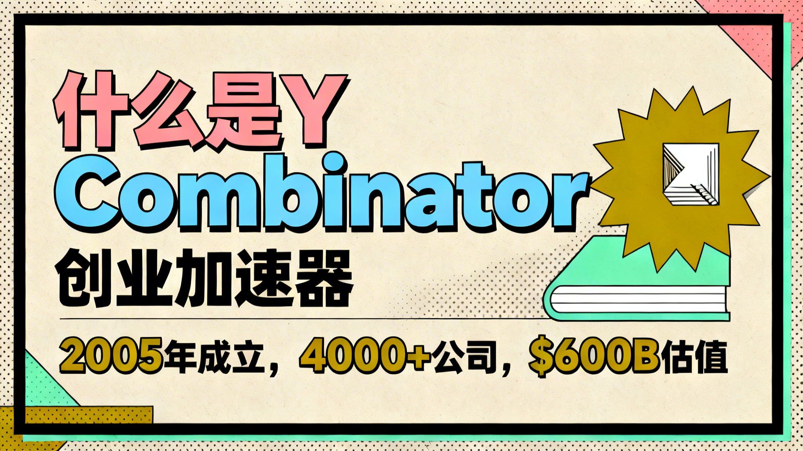 |

---

### 2. Minimalist Clean (极简主义)
**特点**: 白色背景、大量留白、细雅线条、企业美学

| English | 中文 |
|---------|------|
|  | 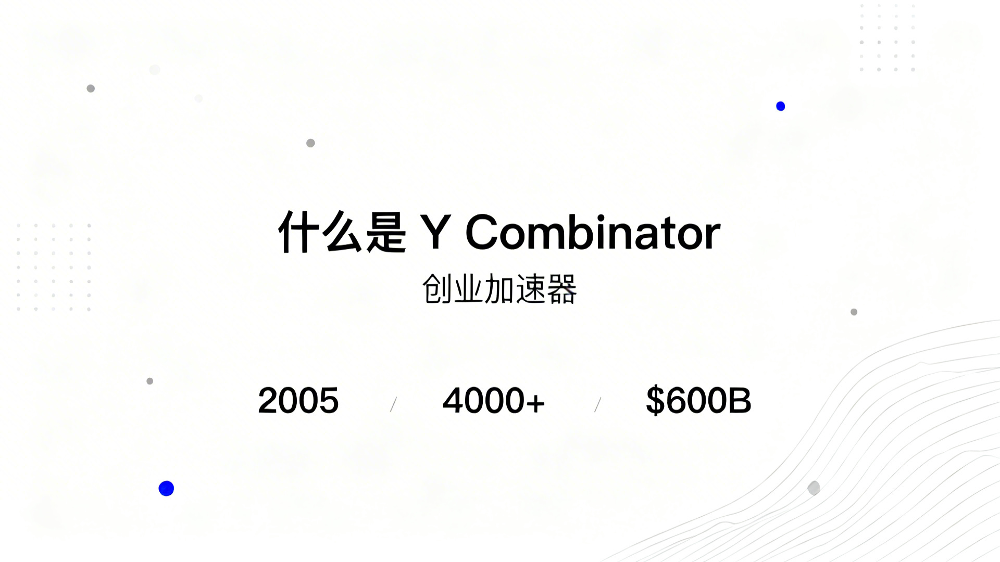 |

---

### 3. Cyberpunk Neon (赛博朋克)
**特点**: 深色背景、霓虹发光、科技网格、未来主义

| English | 中文 |
|---------|------|
|  | 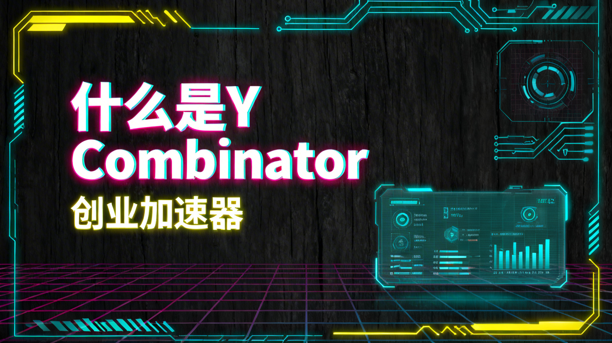 |

---

### 4. Neo-Brutalism (新粗野主义)
**特点**: 奶油色背景、大胆原色、4px 粗黑边框、硬阴影

| English | 中文 |
|---------|------|
|  | 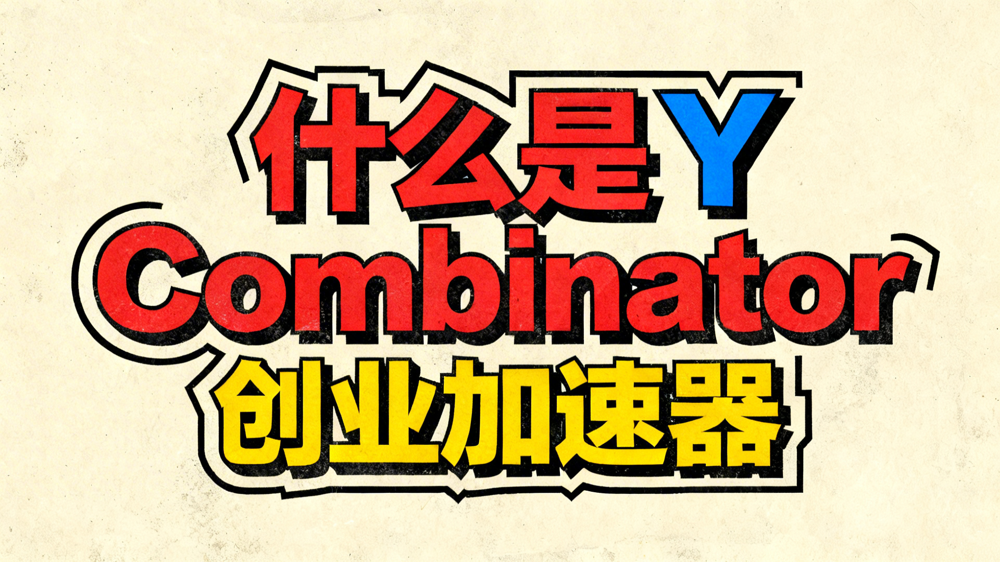 |

---

### 5. Acid Graphics Y2K (酸性设计)
**特点**: 金属铬元素、全息点缀、液态形状、Y2K 美学

| English | 中文 |
|---------|------|
|  | 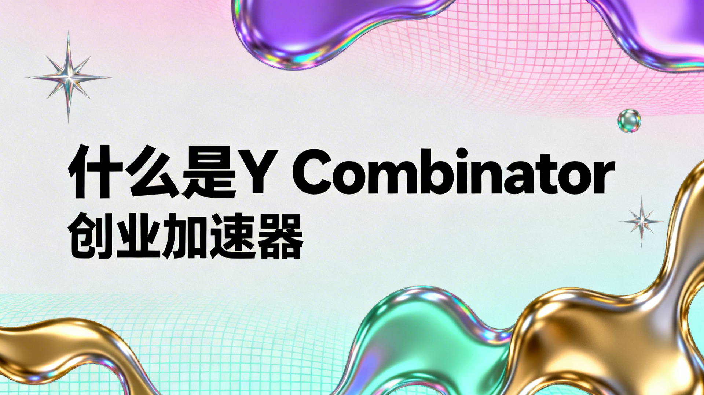 |

---

### 6. Modern Minimal Pop (现代极简波普)
**特点**: 柔和粉彩背景、星爆图形、瑞士设计影响

| English | 中文 |
|---------|------|
|  | 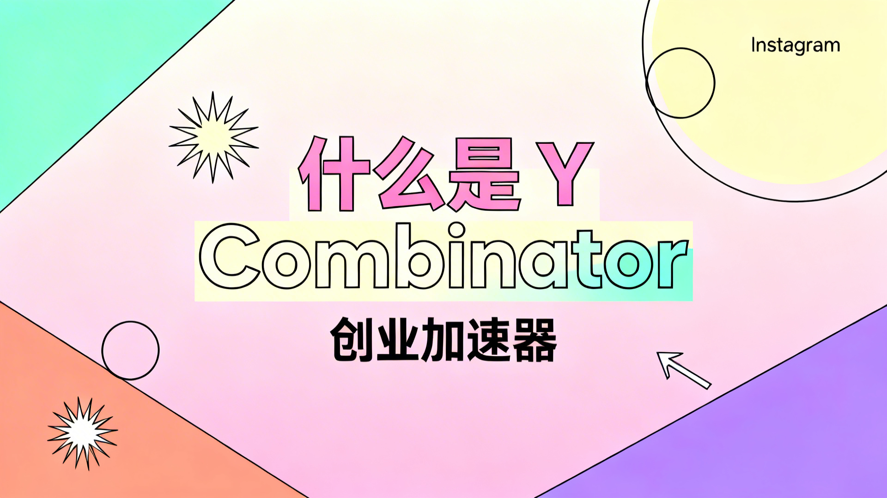 |

---

### 7. Swiss International (瑞士国际主义)
**特点**: 大胆几何色块、斜向排版、Helvetica 字体

| English | 中文 |
|---------|------|
|  | 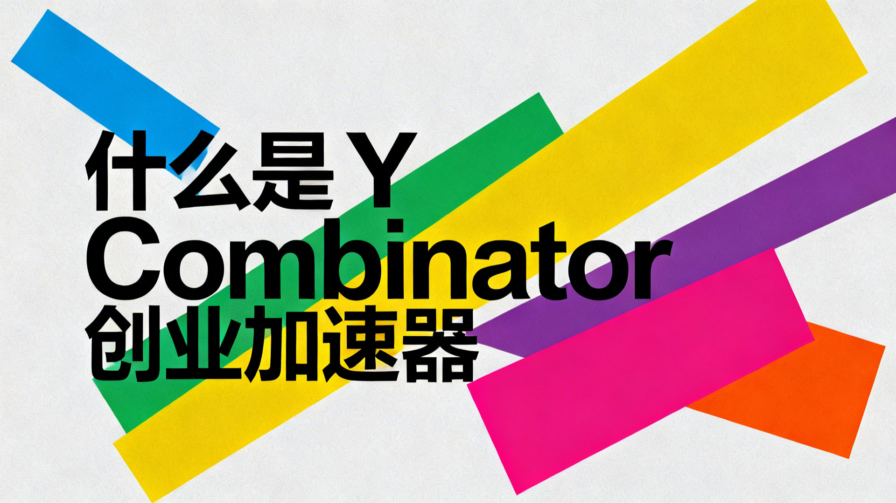 |

---

### 8. Dark Editorial (暗黑 Editorial)
**特点**: 黑色背景配白色点阵、衬线字体、报纸美学

| English | 中文 |
|---------|------|
|  | 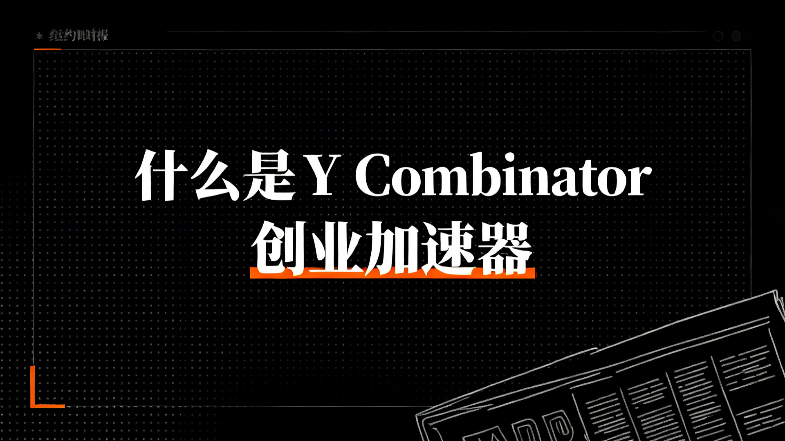 |

---

### 9. Design Blueprint (设计蓝图)
**特点**: Figma 文档风格、青色网格线、技术 UI 模型

| English | 中文 |
|---------|------|
|  | 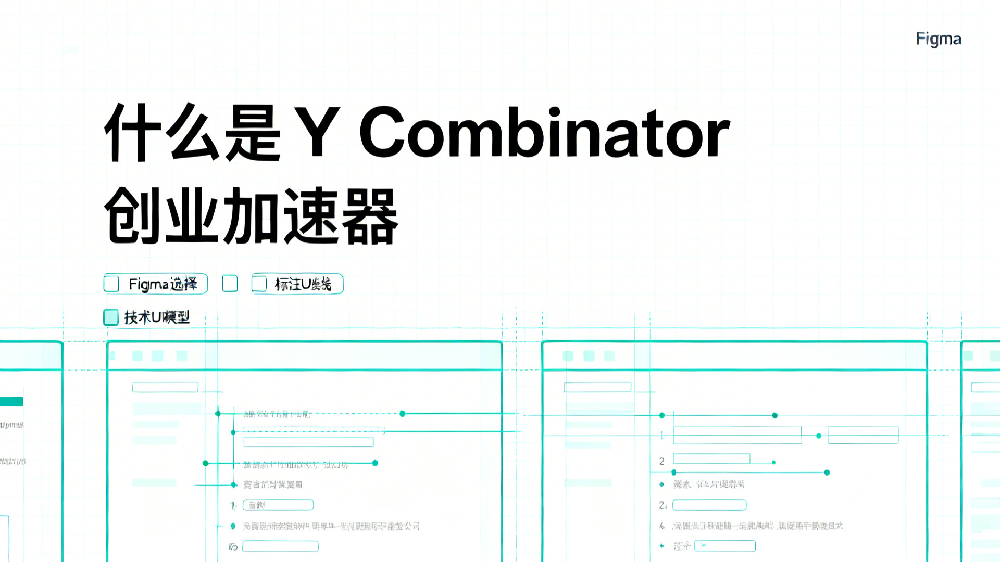 |

---

### 10. Neo-Brutalist UI (粗野主义 UI)
**特点**: 仪表板界面、柔和色板、卡片布局、SaaS 美学

| English | 中文 |
|---------|------|
|  | 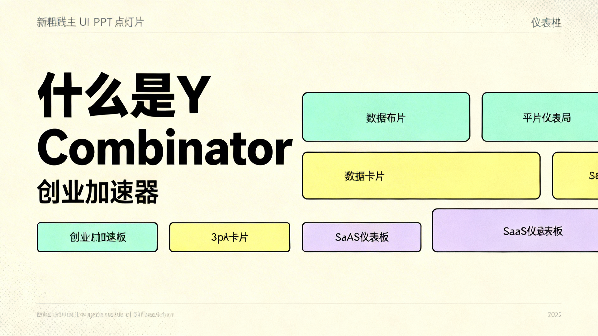 |

---

### 11. Y2K Pixel Retro (Y2K 像素复古)
**特点**: 90 年代美学、像素艺术、CRT 显示器、复古设计

| English | 中文 |
|---------|------|
|  | 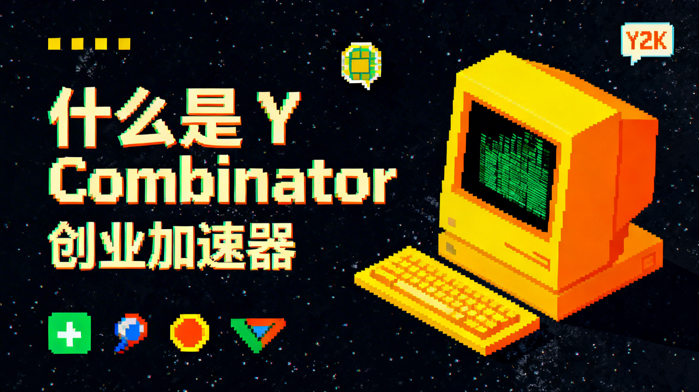 |

---

### 12. Bento Grid (便当盒网格)
**特点**: 模块化圆角卡片矩阵、产品展示页、KPI 组合布局

| English | 中文 |
|---------|------|
|  | 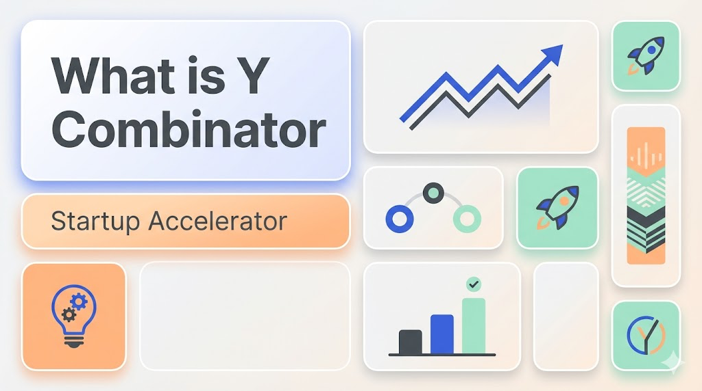 |

---

### 13. Scrapbook DIY Vibe (剪贴板手作风格)
**特点**: 撕纸拼贴、胶带贴纸、手写批注、年轻化海报语言

| English | 中文 |
|---------|------|
|  | 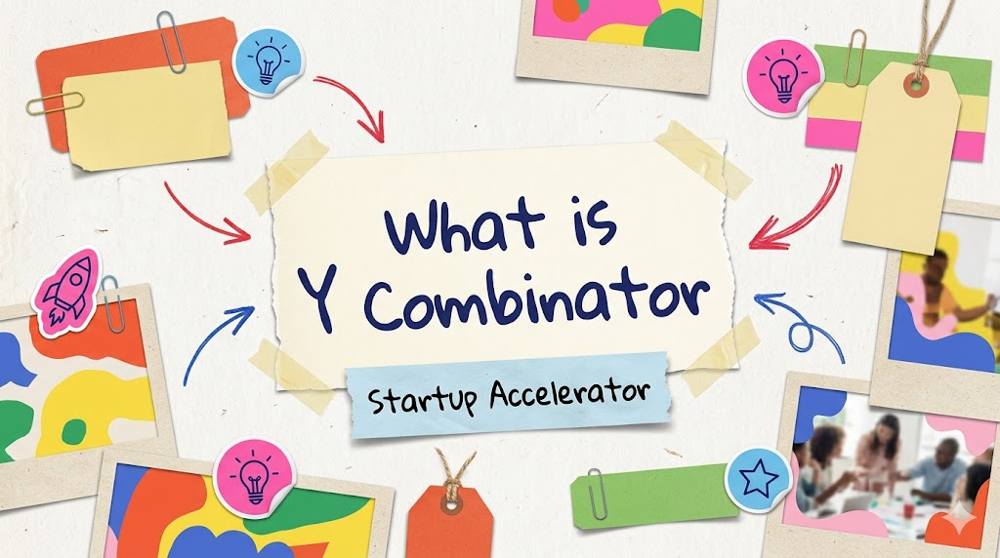 |

---

### 14. Aurora UI (极光流体界面)
**特点**: 暗色 mesh gradient、流体极光、高端 AI / SaaS 气质

| English | 中文 |
|---------|------|
|  |  |

---

### 15. Light Glassmorphism (轻盈毛玻璃拟态)
**特点**: 明亮磨砂玻璃、轻盈漂浮卡片、现代产品封面感

| English | 中文 |
|---------|------|
|  |  |

---

### 16. Dark Glassmorphism (暗黑玻璃拟态)
**特点**: 深色毛玻璃、AI 控制台氛围、高对比高级 SaaS 美学

| English | 中文 |
|---------|------|
|  |  |

---

### 17. Frutiger Aero (乐观科技风)
**特点**: 2000s 科技乌托邦、玻璃高光、水感气泡、天空草地

| English | 中文 |
|---------|------|
|  |  |

---

### 18. Claymorphism (黏土拟态)
**特点**: 厚实体圆角、糖果色、玩具化 3D 质感、友好 onboarding 氛围

| English | 中文 |
|---------|------|
|  |  |

---

### 19. Classic Deep Skeuomorphism (经典深度拟物化)
**特点**: 皮革缝线、拉丝金属、玻璃高光、复古科技实体隐喻

| English | 中文 |
|---------|------|
|  |  |

---

## 生成信息

- **模型**: bytedance/seedream-v4 (Seedream 4.0)
- **平台**: 302.ai
- **分辨率**: 1920x1080 (16:9)
- **数量**: 38 张图片 (19 种风格 × 2 种语言)
- **生成时间**: 2024-03-24

### 新增 8 张图片说明

- **风格范围**: `12` 到 `19`
- **生成模型**: Nano Banana 2 / Pro
- **当前处理方式**: 因为本轮只手动补了单图版本，所以 `EN / CN` 暂时复用同一张图

## 使用脚本

```bash
# 安装依赖
source .venv/bin/activate
pip install requests

# 运行生成脚本
python demos/yc-intro/generate-seedream-final.py
```

## 下载图片

所有图片位于 `demos/yc-intro/images/` 目录：

```bash
# 下载单张图片
curl -O https://raw.githubusercontent.com/AAAAAAAJ/slides/main/demos/yc-intro/images/01-retro-pop-en.png
```

## 风格 Prompt 模板

每种风格的 Prompt 都保存在 `styles/` 目录的 JSON 文件中：

- `styles/retro-pop.json` - 复古波普
- `styles/minimal.json` - 极简主义
- `styles/cyberpunk.json` - 赛博朋克
- `styles/neo-brutalism.json` - 新粗野主义
- `styles/acid-graphics.json` - 酸性设计
- `styles/modern-minimal-pop.json` - 现代极简波普
- `styles/swiss-international.json` - 瑞士国际主义
- `styles/dark-editorial.json` - 暗黑 Editorial
- `styles/design-blueprint.json` - 设计蓝图
- `styles/neo-brutalist-ui.json` - 粗野主义 UI
- `styles/y2k-pixel-retro.json` - Y2K 像素复古
- `styles/bento-grid.json` - 便当盒网格
- `styles/scrapbook-diy.json` - 剪贴板手作风格
- `styles/aurora-ui.json` - 极光流体界面
- `styles/glassmorphism-light.json` - 轻盈毛玻璃拟态
- `styles/dark-glassmorphism.json` - 暗黑玻璃拟态
- `styles/frutiger-aero.json` - 乐观科技风
- `styles/claymorphism.json` - 黏土拟态
- `styles/classic-deep-skeuomorphism.json` - 经典深度拟物化

---

## 下一步

1. 选择你喜欢的风格
2. 使用对应的 Prompt 模板生成自己的内容
3. 或者反推新的图片风格，添加到项目中

**项目地址**: https://github.com/AAAAAAAJ/slides
